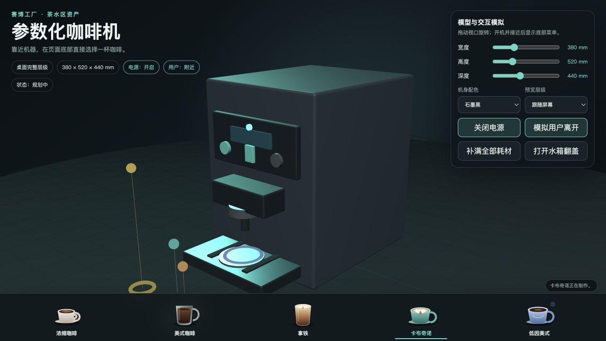
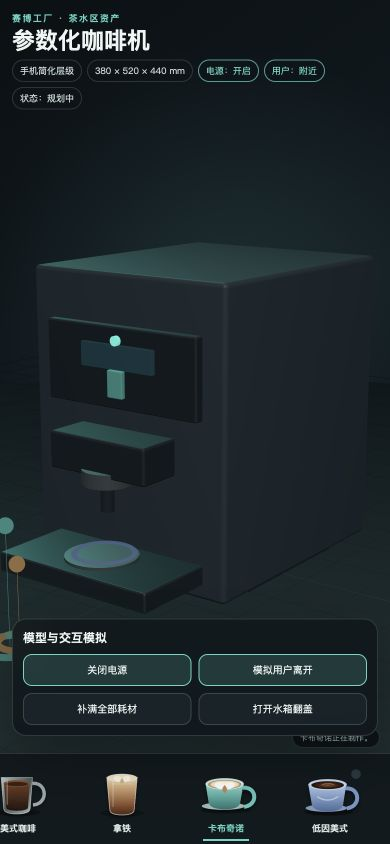

# 参数化咖啡机资产

该目录独立交付赛博工厂茶水区咖啡机，不修改公共模型注册表或共享协议。资产模块保持 `planned`，等待领域包注册流程统一接入。

## 交付内容

- `model.ts`：可调整宽度、高度、深度与石墨黑、瓷白、钴蓝三种配色的硬朗工业几何工厂；外壳仅保留 2–8 mm 小倒角。
- `operations.ts`：可配置的容量、初始库存和单杯配方；内部维护水、牛奶与阿拉比卡、罗布斯塔、低因三类豆仓，提供库存预检、原子扣减与补满操作。
- `manifest.ts`：稳定 ID、材质槽、地面基准、机身/托盘碰撞体、电源/接近菜单触发/制作/取杯/杯位/补水锚点、水箱翻盖关节，以及桌面和移动 LOD。
- `images/*.svg`：浓缩、美式、拿铁、卡布奇诺和低因美式五张透明背景本地饮品图片，不依赖远程资源。
- `preview.html` / `preview.ts`：不依赖公共 registry 的独立交互预览，可调整参数、切换电源与指示灯状态、模拟用户接近、从贴边全宽且可横向滚动的底部图片栏选择咖啡，并开合水箱翻盖。
- `coffee-machine.test.ts` / `operations.test.ts`：契约、参数边界、稳定 ID、锚点、移动 LOD、配方差异、库存配置和原子扣减测试。
- `tsconfig.json`：独立覆盖资产工厂、测试和预览代码的严格类型检查。

## 独立预览

从仓库根目录运行：

```bash
npx vite --host 127.0.0.1
```

打开 `/domain-packages/cyber-factory/models/coffee-machine/preview.html`。窄屏会自动切换至移动 LOD，可通过右上角设备选择器显式切换。

预览中的菜单只在电源开启且模拟用户进入正面接近范围后显示。底栏完整贴住页面左右和底边，饮品项没有卡片背景或边框；桌面端自动均分，窄屏通过触摸或滚轮横向滚动。界面只展示饮品图片和名称，不向饮用者展示水量、奶量、豆种或库存等内部细节。选择饮品仍会按照配方在内部扣减库存；容量、初始库存和配方均可通过 `operations.ts` 导出的纯函数与类型配置。

> 资产模块仍为 `planned`。当前交付了可复用计算逻辑、接近锚点语义和独立预览，但公共运行时尚未接入接近事件、菜单投影与库存动作。

局部验证：

```bash
npx tsc -p domain-packages/cyber-factory/models/coffee-machine/tsconfig.json
npx vitest run domain-packages/cyber-factory/models/coffee-machine/coffee-machine.test.ts domain-packages/cyber-factory/models/coffee-machine/operations.test.ts
```

## 验收截图

桌面端 1280 × 720：



手机端 390 × 844：



## 坐标约定

- 单位：`mm`
- 上轴：`y`
- 机身正面：`+z`
- 地面基准：`y = 0`
- 制作和取杯锚点位于机身正面外侧；杯位锚点位于出液口下方的托盘上。
