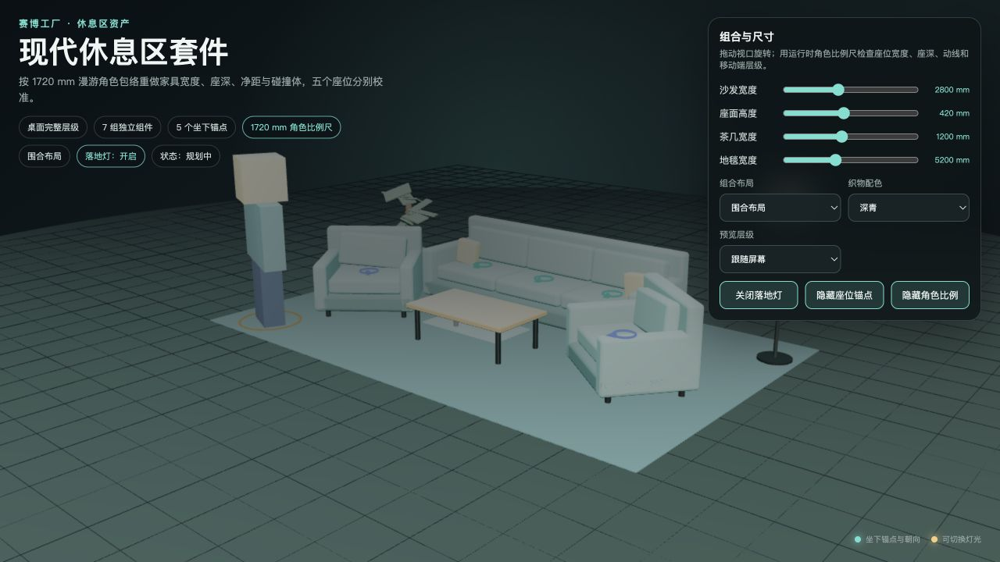
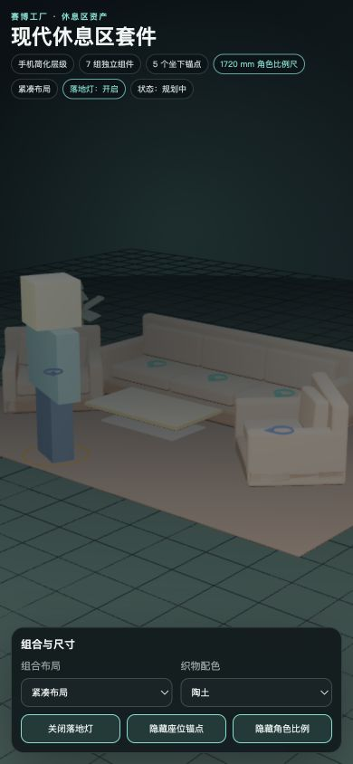

# 现代休息区资产套件

该目录提供赛博工厂休息区的领域预览和验证；几何工厂由 `@solidloom/shared` 统一维护，并已注册到 SolidLoom 模型目录和交互试验场。

## 交付内容

- `model.ts`：三人沙发、左右单椅、茶几、地毯、落地灯和绿植七组独立组件；集中维护物理尺寸，支持围合、并列和紧凑三种布局，以及深青、陶土和暖沙三套织物配色。
- `manifest.ts`：稳定 ID、织物/木材/金属/玻璃/陶质材质槽、零地面基准、六组独立碰撞体、五个坐下锚点、茶几与落地灯交互锚点，以及桌面和手机 LOD。
- `preview.html` / `preview.ts`：不依赖公共 registry 的独立 Three.js 预览，可调整沙发、座面、茶几和地毯尺寸，切换布局、配色、预览层级、落地灯、座位锚点和 1720 mm 漫游角色比例尺。
- `lounge.test.ts`：共享场景契约、稳定 ID、组件分组、参数边界、人体比例、家具包络、地面基准、座位位置与朝向、碰撞体、灯光状态和移动 LOD 测试。
- `tsconfig.json`：独立覆盖模型、manifest、测试和预览代码的严格类型检查。

## 组件与交互

套件中的每组家具都拥有独立 `FeatureGroup`，可以按组引用、显隐或重新组合：

- 三人沙发：三个独立坐下锚点。
- 左右单椅：各自拥有一个坐下锚点，锚点朝向随布局旋转。
- 茶几：独立碰撞体与放置/取物交互锚点。
- 落地灯：独立碰撞体与电源交互锚点，预览中提供可见灯光反馈。
- 地毯和绿植：保持独立分组；绿植拥有简化碰撞体。

所有地毯、家具支脚、灯座和花盆都以 `y = 0` 为地面基准。移动端近景层级会省略支脚、抱枕和部分叶片，保留沙发、单椅、茶几、灯具、地毯和绿植的主要轮廓。

## 尺度基准

- 预览使用当前办公空间运行时的 1720 × 860 mm 方块漫游角色包络作为比例尺。
- 默认沙发为 2800 × 900 × 850 mm，座面高 420 mm；三个座位中心按角色肩宽分布。
- 默认单椅为 1040 × 860 × 830 mm，座面高与沙发一致，可容纳方块角色肩部包络。
- 默认茶几高 380 mm，低于座面；地毯厚 10 mm。
- 默认落地灯高 1650 mm。默认地毯宽 5200 mm，三种布局均保证单椅可见包络留在地毯边界内。
- 几何、座位锚点和碰撞体共同引用 `loungeDimensions`，避免分别硬编码后再次漂移。

## 独立预览

从仓库根目录运行：

```bash
apps/web/node_modules/.bin/vite --host 127.0.0.1
```

打开 `/domain-packages/cyber-factory/models/lounge/preview.html`。窄屏自动切换手机 LOD，也可以通过“预览层级”显式切换。

> 模型模块状态为 `available`。独立预览用于布局验收；SolidLoom 交互试验场已接入沙发、单椅坐下动作与落地灯开关。

局部验证：

```bash
npx tsc -p domain-packages/cyber-factory/models/lounge/tsconfig.json
npx vitest run domain-packages/cyber-factory/models/lounge/lounge.test.ts
```

## 验收截图

桌面端 1280 × 720：



手机端 390 × 844：


